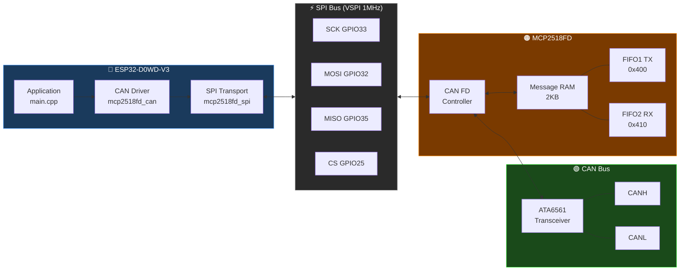

# MCP2518FD CAN FD Driver for ESP32

A register-level CAN FD driver for the **MCP2518FD** external CAN FD controller, running on an **ESP32** over SPI. Built directly from the Microchip datasheet as the source of truth — every register address, bit position and field definition is verified against the official documentation before any code is written.

Development is spec-driven: every new feature starts as a spec in [`docs/specs/`](docs/specs/), is implemented against that spec, and is verified on two real hardware nodes before being committed. See [`docs/use_case_coverage.md`](docs/use_case_coverage.md) for the full real-world use case analysis and gap tracking.

## System overview



## Why this exists

Every existing Arduino/ESP32 CAN FD library for the MCP2518FD either wraps Microchip's own `canfdspi` API or makes undocumented assumptions about register state. This project builds the driver from scratch, one register at a time, verified against the official Microchip datasheets at every step.

The result is a minimal, auditable reference implementation that anyone can follow, extend, or port — with a clear paper trail from datasheet to working hardware for every decision made.

## Hardware

| Item | Detail |
|---|---|
| MCU | ESP32-D0WD-V3 (rev 3.1) |
| CAN controller | MCP2518FD |
| Oscillator | 20 MHz crystal (SCLKDIV=0, PLLEN=0 → FSYS=20 MHz) |
| Transceiver | ATA6561 |
| SPI bus | VSPI — SCK=33, MISO=35, MOSI=32, CS=25 |
| INT | GPIO 34 (interrupt input — used by SPEC-004) |

## Progress

| Milestone | Status |
|---|---|
| SPI transport (read8/16/32, write8/32, reset) | ✅ Verified |
| Mode control (config, internal loopback) | ✅ Verified |
| Nominal + data bit timing (125 kbps nominal / 2 Mbps data) | ✅ Verified |
| TDC (transmitter delay compensation, auto mode) | ✅ Verified |
| FIFO register definitions | ✅ Verified |
| FIFO1=TX, FIFO2=RX configuration | ✅ Verified |
| RAM allocation (UA offsets confirmed) | ✅ Verified |
| Transmit a frame (internal loopback) | ✅ Verified |
| Receive a frame (internal loopback) | ✅ Verified |
| Full loopback round-trip verify | ✅ Verified |
| Multi-frame + runtime bitrate switch | ✅ Verified |
| Driver refactor — clean layered API | ✅ Verified |
| Full 64-byte CAN FD payload (DLC=15) | ✅ Verified |
| Data rates 4/5/8 Mbps | ✅ Verified |
| Physical bus output (MODE_EXTERNAL_LB, scope verified) | ✅ Verified |
| Normal CAN FD mode (two-node) | ✅ Verified |
| OSC auto-detection + rate-based API | ✅ Verified |
| Correct timing for 20 MHz hardware (scope: 24 µs @ 125 kbps) | ✅ Verified |
| RATE_NOT_ACHIEVABLE error path + raw API loopback | ✅ Verified |

### Roadmap

| Spec | Feature | Status |
|---|---|---|
| [SPEC-001](docs/specs/SPEC-001-extended-id.md) | 29-bit extended ID (EID) | Pending |
| [SPEC-002](docs/specs/SPEC-002-acceptance-filters.md) | Acceptance filter API | Pending |
| [SPEC-003](docs/specs/SPEC-003-bus-error-and-tx-result.md) | Bus error detection + TX error detail | Pending |
| [SPEC-004](docs/specs/SPEC-004-interrupt-rx-and-fifo-depth.md) | Interrupt-driven RX + configurable FIFO depth | Pending |
| [SPEC-005](docs/specs/SPEC-005-rx-timestamp-and-listen-only.md) | RX timestamp + listen-only mode | Pending |
| [SPEC-006](docs/specs/SPEC-006-stop-restart-sleep.md) | stop() / restart() / sleep() | Pending |

See [`docs/status.md`](docs/status.md) for detailed notes and observed values from each verified step.
See [`docs/specs/README.md`](docs/specs/README.md) for the full spec index and implementation order.

## Repository layout

This repository is structured as a standard PlatformIO library:

```
include/
  mcp2518fd_can.h           # Public driver API — CanMsg, MCP2518Driver, presets
  mcp2518fd_spi.h           # SPI transport layer
  mcp2518fd_registers.h     # All register addresses, masks and constants

src/
  mcp2518fd_can.cpp         # CAN driver implementation
  mcp2518fd_spi.cpp         # SPI transport implementation

examples/
  loopback/                 # Regression test — single-board internal loopback
  two_node/                 # Two-node CAN FD test — bidirectional over real bus
  walkie_talkie/            # Text chat between two nodes over CAN FD
  scope_loopback/           # Continuous TX in MODE_EXTERNAL_LB for scope measurements
  bus_monitor/              # Two nodes continuously talking — bus load + integrity check

docs/
  status.md                 # Verified milestone tracker
  context.md                # Hardware decisions and discoveries
  registers.md              # Register field reference
  use_case_coverage.md      # Real-world use case analysis and gap tracking
  specs/                    # One spec per feature — read before implementing
    README.md               # Spec index and implementation order
    SPEC-001-*.md           # 29-bit extended ID
    SPEC-002-*.md           # Acceptance filters
    SPEC-003-*.md           # Bus error detection + TX error detail
    SPEC-004-*.md           # Interrupt RX + configurable FIFO depth
    SPEC-005-*.md           # RX timestamp + listen-only mode
    SPEC-006-*.md           # stop() / restart() / sleep()
  search.py                 # PDF search tool — queries both datasheets
  reference/                # Place downloaded PDFs here (see reference/README.md)

tools/
  run_test.py               # Automated test runner for loopback and two-node
  check_timing.py           # Verify bit timing preset values against datasheet formula
  find_timing.py            # Calculate correct NBTCFG/DBTCFG values for a target rate

library.json                # PlatformIO library manifest
library.properties          # Arduino IDE library manifest
```

## Examples

Each example is a self-contained PlatformIO project. Open the example directory in PlatformIO to build and upload.

### loopback

Single-board regression test. Runs entirely inside the MCP2518FD chip using `MODE_INTERNAL_LB` — no bus wiring required. Covers single frames, multi-frame bursts, 64-byte payloads, and data rates from 2 to 8 Mbps. Every assertion prints `OK` or `FAIL`.

```bash
cd examples/loopback
pio run --target upload --upload-port <PORT>
python ../../tools/run_test.py --env loopback --port <PORT>
```

### two_node

Two-board bidirectional test over a real CAN bus. Both boards run the same firmware — send `A` to one and `B` to the other. Tests A→B and B→A at 2/4/5 Mbps data rates with 8-byte and 64-byte payloads. No PC coordination required — the chip's retransmission logic handles any power-on race.

Requires: two boards wired CANH↔CANH, CANL↔CANL, 120Ω termination at each end.

```bash
cd examples/two_node
pio run --target upload --upload-port <PORT_A>
pio run --target upload --upload-port <PORT_B>
python ../../tools/run_test.py --env two_node --port-a <PORT_A> --port-b <PORT_B>
```

### walkie_talkie

Text chat between two boards over CAN FD. Type a message in the Serial monitor and press Enter (or wait 300ms) — it arrives on the other board's Serial monitor. Messages up to 63 characters, chunked into 8-byte CAN FD frames automatically.

```bash
cd examples/walkie_talkie
pio run --target upload --upload-port <PORT>
# Open two serial monitors, one per board, at 115200 baud
```

### scope_loopback

Single-board continuous TX in `MODE_EXTERNAL_LB` for oscilloscope measurements. Drives real differential signals on CANH/CANL via the ATA6561 transceiver while the chip ACKs its own frames — no second node required. Press any key to cycle through 2/4/5 Mbps data rates. Prints detected FSYS on startup.

```bash
cd examples/scope_loopback
pio run --target upload --upload-port <PORT>
```

### bus_monitor

Two boards in `MODE_NORMAL`, both transmitting a counter frame with a `0xDEADBEEF` integrity marker. Each board prints every frame it receives. Adjustable TX interval with `+`/`-`. Good for scope measurements of real two-node bus traffic and for watching the bus under load.

```bash
cd examples/bus_monitor
pio run --target upload --upload-port <PORT>
# Send 'A' to one board, 'B' to the other via serial monitor
```

## API

```cpp
#include "mcp2518fd_can.h"

MCP2518Driver can(spi, PIN_CS);

// Configure — just specify the rates you want.
// The driver reads the OSC register after reset, detects FSYS automatically,
// calculates NBTCFG/DBTCFG/TDC from first principles, and enters the requested mode.
CanStatus s = can.configure(125000, 2000000, MODE_NORMAL);  // 125 kbps nominal, 2 Mbps data
if (s != CanStatus::OK) { /* handle error */ }

// Transmit
CanMsg tx = { .sid=0x123, .fdf=true, .brs=true, .dlc=8 };
for (int i = 0; i < 8; i++) tx.data[i] = i;
can.transmit(tx);

// Non-blocking receive
if (can.available()) {
    CanMsg rx;
    can.receive(rx);
}

// Blocking receive with timeout
CanMsg rx;
can.receive(rx, 500);  // wait up to 500ms

// Switch data rate at runtime — auto-calculated, no register values needed
can.setDataRate(4000000);  // 4 Mbps data

// Inspect detected oscillator frequency
Serial.printf("FSYS: %lu Hz\n", can.getFsys());  // e.g. 20000000 or 40000000
```

### CanStatus

| Value | Meaning |
|---|---|
| `CanStatus::OK` | Success |
| `CanStatus::MODE_TIMEOUT` | Chip did not confirm the requested mode |
| `CanStatus::RATE_NOT_ACHIEVABLE` | Target rate cannot be reached at the detected FSYS |
| `CanStatus::CLOCK_NOT_READY` | OSC register shows clock not stable after reset |

### Supported rates

The driver calculates timing for any rate where `FSYS` divides evenly into an integer number of time quanta with at least 3 TQ. Common rates at 20 MHz and 40 MHz:

| Nominal | Data | 20 MHz | 40 MHz |
|---|---|---|---|
| 125 kbps | 1–5 Mbps | ✅ | ✅ |
| 250 kbps | 1–5 Mbps | ✅ | ✅ |
| 500 kbps | 1–5 Mbps | ✅ | ✅ |
| 1 Mbps | 1–5 Mbps | ✅ | ✅ |
| any | 8 Mbps | ❌ not achievable | ✅ |

### Raw / advanced API

For direct register control (non-standard rates, custom oscillators):

```cpp
// Bypass auto-detection — supply pre-computed register words directly
can.configureRaw(NBTCFG_125K_40MHZ, DBTCFG_2M_40MHZ, TDC_2M_40MHZ, MODE_NORMAL);
can.setDataBitTimingRaw(DBTCFG_8M_40MHZ, TDC_8M_40MHZ);
```

Presets for 20 MHz and 40 MHz oscillators are defined in `mcp2518fd_can.h` (e.g. `NBTCFG_125K_20MHZ`, `DBTCFG_2M_40MHZ`). All use BRP=0, exact rates, 80% sample point.

## Key implementation decisions

- **Rate-based API** — `configure(nominalBps, dataBps, mode)` auto-detects FSYS from the OSC register and calculates all timing registers from first principles; no preset knowledge required
- **OSC auto-detection** — reads PLLEN and SCLKDIV from the OSC register after reset to determine FSYS; works correctly with 20 MHz and 40 MHz oscillators
- **Three-layer architecture** — `mcp2518fd_spi` owns SPI transport, `mcp2518fd_can` owns all chip logic, examples are pure consumers with no register names or RAM addresses
- **Calculated TX timeout** — derived from configured bit timing at runtime; worst-case 64-byte frame × 3 retransmission attempts + 2ms margin
- **RTXAT + TXAT=3** — chip retries up to 3 times on no-ACK then clears TXREQ cleanly; `transmit()` checks TXABT/TXERR to distinguish success from failure
- **setDataRate() fails before touching the chip** — timing is calculated before entering config mode; a `RATE_NOT_ACHIEVABLE` result leaves the chip in its current mode untouched
- **No 32-bit RMW of CiCON** — REQOP is written via `write8()` to byte 3 only
- **No TXQ, no TEF** — FIFO1=TX, FIFO2=RX only
- **UA is an offset** — `CiFIFOUAm` holds byte offset from RAM base `0x400`; actual address = `0x400 + UA`
- **TDC required at ≥ 1 Mbps** — automatic mode, TDCO = (BRP+1) × (TSEG1+1)
- **Spec-driven development** — every new feature starts as a spec in `docs/specs/`, is implemented against that spec, and is verified on two real hardware nodes before commit

## Source of truth

All register addresses, bit positions and field definitions are verified against the official Microchip documentation before any code is written:

| Document | ID | Link |
|---|---|---|
| MCP2518FD Datasheet | DS20006027B | https://www.microchip.com/en-us/product/MCP2518FD |
| MCP25XXFD Family Reference Manual | DS20005678E | https://www.microchip.com/en-us/product/MCP2518FD |

PDFs are not committed to this repo. Download them from the links above and place them in `docs/reference/` — see [`docs/reference/README.md`](docs/reference/README.md).

## Prerequisites

- [PlatformIO Core](https://docs.platformio.org/en/latest/core/installation/index.html) 6.x
- Espressif32 platform 7.0.1

Optional (test runner and PDF search tool):
```bash
pip install -r requirements.txt
```

## License

MIT
