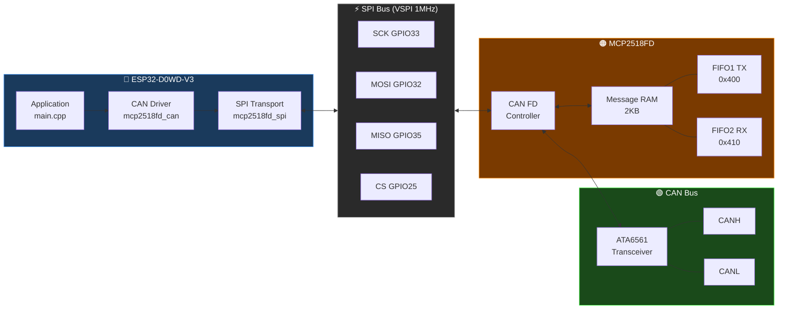

# MCP2518FD CAN FD Driver for ESP32

A clean, auditable CAN FD driver for the **MCP2518FD** controller on **ESP32** over SPI.
No third-party CAN library. No undocumented assumptions. Every register address, bit position
and field definition is verified against the official Microchip datasheets before any code is written.

```cpp
MCP2518Driver can(spi, PIN_CS);
can.configure(500000, 2000000, MODE_NORMAL);  // 500 kbps nominal, 2 Mbps data — done

CanMsg tx = { .id=0x123, .fdf=true, .brs=true, .dlc=8 };
can.transmit(tx);

CanMsg rx;
can.receive(rx, 500);  // blocking, 500 ms timeout
```

---

## Use cases

| Use case | Description |
|---|---|
| **EV battery gateway** | Read cell voltages, SOC and temperatures from a CAN FD BMS (Kia 64 FD, VW MEB) and re-publish over a second bus or WiFi |
| **UDS diagnostics** | Send ISO 14229 requests to a vehicle ECU over CAN FD and receive multi-frame ISO-TP responses |
| **Inverter interface** | Send torque/speed setpoints to a CAN FD motor controller and read back telemetry at 10 ms intervals |
| **CAN FD data logger** | Capture every frame on a bus with per-frame timestamps, stream in candump format over USB Serial |
| **Peer-to-peer telemetry** | Two ESP32 boards talking directly over CAN FD — sensor nodes, drone ESCs, data concentrators |
| **Scope / analyser stimulus** | Drive known CAN FD frames onto the bus for oscilloscope or protocol analyser capture |
| **Production self-test** | Verify chip and transceiver wiring at factory or field bring-up — no second node required |

See [`docs/use_case_coverage.md`](docs/use_case_coverage.md) for the full feature-by-use-case coverage matrix and gap tracking.

---

## Features

| Feature | Status |
|---|---|
| Auto-detect oscillator frequency (20 MHz / 40 MHz) from OSC register | ✅ |
| Calculate all bit timing registers from target rates — no presets required | ✅ |
| Transmitter delay compensation (TDC) auto-configured at ≥ 1 Mbps | ✅ |
| Transmit CAN FD frames up to 64 bytes (DLC 0–15) | ✅ |
| Receive CAN FD frames, non-blocking and blocking with timeout | ✅ |
| Data rates 1 / 2 / 4 / 5 Mbps at 20 MHz; up to 8 Mbps at 40 MHz | ✅ |
| Runtime data rate switch without losing nominal configuration | ✅ |
| Internal loopback mode (no bus required) | ✅ |
| External loopback mode (real bus signals, self-ACK) | ✅ |
| Listen-only mode (passive, no ACK) | ✅ |
| Two-node normal mode — verified on real hardware | ✅ |
| Raw / advanced API for non-standard rates and custom oscillators | ✅ |
| 29-bit extended ID (EID) — 11-bit and 29-bit on the same bus | ✅ |
| Acceptance filter API — per-SID, per-range, per-mask | ✅ |
| Bus error detection — TEC/REC counters, bus-off flag | ✅ |
| TX error detail — distinguish no-ACK, bus error, FIFO full | ✅ |
| Interrupt-driven RX via INT pin — frame arrival wakes ISR, no polling | ✅ |
| Configurable RX FIFO depth (1–24 slots at 64-byte payload) | ✅ |
| Per-frame RX timestamp from hardware time base counter | 🔜 |
| stop() / restart() / sleep() lifecycle control | 🔜 |

---

## Why this driver

Existing Arduino/ESP32 CAN FD libraries for the MCP2518FD are wrappers around Microchip's
reference `canfdspi` API — a codebase full of undocumented assumptions, magic numbers and
silent failure modes. In production hardware — EV gateways, inverter interfaces, diagnostic
tools — that is not acceptable. A driver that works on a desk but drops frames under load,
or silently misconfigures bit timing, is worse than no driver at all.

This driver was built because nothing available could be trusted in a real product.

- **Production-grade reliability** — every feature is verified on two real hardware nodes
  under real bus conditions before it ships. Bus signals are confirmed on a DSO. If it isn't
  verified on hardware, it isn't in the driver.
- **Zero hidden state** — every register write traces directly to a datasheet page. No magic
  numbers, no inherited assumptions, no surprises when you read the source.
- **Minimal and dependency-free** — no RTOS, no heap allocation, no third-party CAN library.
  Just Arduino SPI and direct register access. Less code means fewer failure modes.
- **Spec-driven** — every feature starts as a written spec with explicit acceptance criteria.
  Code follows the spec. The spec is in the repo. You can read exactly what was intended and
  exactly what was verified.

The result is a driver you can ship in a product and stand behind.

---

## Verified on real hardware

Every feature in this driver was developed and verified on real hardware — not simulated,
not assumed. The oscilloscope capture below shows a live CAN FD data burst on the bus:
CANH, CANL, and the A−B differential signal. Clean edges, correct differential swing, no
ringing. This is what the driver produces on real silicon.


Other ESP32 boards and MCP2518FD breakout variants should work provided the SPI pins are configured correctly.


| Item | Detail |
|---|---|
| MCU | ESP32-D0WD-V3 (rev 3.1) |
| CAN controller | MCP2518FD |
| Oscillator | 20 MHz crystal (SCLKDIV=0, PLLEN=0 → FSYS=20 MHz) |
| Transceiver | ATA6561 |
| SPI bus | VSPI — SCK=33, MISO=35, MOSI=32, CS=25 |
| INT | GPIO 34 |

---

## Installation

**PlatformIO** — add to `platformio.ini`:
```ini
lib_deps = foodyfood/esp32-mcp2518fd-driver
```

**Arduino IDE** — search for `esp32-mcp2518fd-driver` in the Library Manager.

---

## Quick start

```cpp
#include "mcp2518fd_can.h"

SPIClass      spi(VSPI);
MCP2518Driver can(spi, PIN_CS);

void setup() {
    spi.begin(PIN_SCK, PIN_MISO, PIN_MOSI, PIN_CS);

    CanStatus s = can.configure(500000, 2000000, MODE_NORMAL);
    if (s != CanStatus::OK) { /* handle error */ }
}

void loop() {
    // Transmit
    CanMsg tx = { .id=0x123, .fdf=true, .brs=true, .dlc=8 };
    for (int i = 0; i < 8; i++) tx.data[i] = i;
    can.transmit(tx);

    // Non-blocking receive
    CanMsg rx;
    if (can.available()) can.receive(rx);

    // Blocking receive with timeout
    can.receive(rx, 500);

    // Switch data rate at runtime
    can.setDataRate(4000000);  // 4 Mbps

    // Detected oscillator frequency
    Serial.printf("FSYS: %lu Hz\n", can.getFsys());
}
```

### CanStatus

| Value | Meaning |
|---|---|
| `CanStatus::OK` | Success |
| `CanStatus::MODE_TIMEOUT` | Chip did not confirm the requested mode |
| `CanStatus::RATE_NOT_ACHIEVABLE` | Target rate cannot be reached at the detected FSYS |
| `CanStatus::CLOCK_NOT_READY` | OSC register shows clock not stable after reset |

### Supported rates

| Nominal | Data | 20 MHz | 40 MHz |
|---|---|---|---|
| 125 kbps | 1–5 Mbps | ✅ | ✅ |
| 250 kbps | 1–5 Mbps | ✅ | ✅ |
| 500 kbps | 1–5 Mbps | ✅ | ✅ |
| 1 Mbps | 1–5 Mbps | ✅ | ✅ |
| any | 8 Mbps | ❌ | ✅ |

### Raw / advanced API

For direct register control — non-standard rates, custom oscillators:

```cpp
can.configureRaw(NBTCFG_125K_40MHZ, DBTCFG_2M_40MHZ, TDC_2M_40MHZ, MODE_NORMAL);
can.setDataBitTimingRaw(DBTCFG_8M_40MHZ, TDC_8M_40MHZ);
```

Presets for 20 MHz and 40 MHz are defined in `mcp2518fd_presets.h`. All use BRP=0, exact rates, 80% sample point.

---

## Examples

Each example is a self-contained PlatformIO project you can open, build and flash directly.

| Example | Description |
|---|---|
| `examples/walkie_talkie` | Text chat between two boards over CAN FD — type in one Serial monitor, read on the other. |
| `examples/scope_loopback` | Continuous TX in `MODE_EXTERNAL_LB` for oscilloscope measurements — real bus signals, self-ACK. Press any key to cycle through data rates. |
| `examples/bus_monitor` | Two nodes continuously transmitting counters — both start on boot, no serial input required. Flash `node_a` to one board and `node_b` to the other. |
| `examples/int_pin` | Interrupt-driven RX — main loop does other work while frames arrive via GPIO 34. Shows the non-blocking pattern to copy into your own project. |

---

## System overview



---

## Repository layout

```
include/
  mcp2518fd_can.h           # Public driver API — CanMsg, MCP2518Driver
  mcp2518fd_presets.h       # Bit timing preset constants (Arduino-free)
  mcp2518fd_timing.h        # Pure-logic timing functions — calcBitTiming, calcTxTimeout, EID/filter encode
  mcp2518fd_spi.h           # SPI transport layer
  mcp2518fd_registers.h     # All register addresses, masks and constants

src/
  mcp2518fd_can.cpp         # CAN driver implementation
  mcp2518fd_spi.cpp         # SPI transport implementation

examples/
  walkie_talkie/            # Text chat between two nodes over CAN FD
  scope_loopback/           # Continuous TX in MODE_EXTERNAL_LB for scope measurements
  bus_monitor/              # Two nodes continuously talking — good starting point for any two-node project
  int_pin/                  # Interrupt-driven RX via GPIO 34 INT pin

tests/
  integration/
    verify.py               # Entry point — build, upload and verify on real hardware
    single_node/            # Harness: single-board config, bitrates, raw API, error detection, FIFO, INT pin
    id_filter/              # Harness: SID/EID exact, range, multi-filter, catch-all
    two_node/               # Harness: bidirectional real-bus test, COM4 + COM3
    mcp_test/               # runner, suites, upload, serial I/O modules
  unit/
    platformio.ini          # Native PlatformIO env — runs on host, no hardware required
    test/test_unit/
      test_main.cpp         # 50 unit tests: dlcToLen, calcBitTiming, calcTxTimeout, EID/filter encode, register addresses

tools/
  search.py                 # PDF search tool — queries both datasheets

docs/
  status.md                 # Verified milestone tracker
  context.md                # Hardware decisions and discoveries
  registers.md              # Register field reference
  use_case_coverage.md      # Real-world use case analysis and gap tracking
  specs/                    # One spec per feature — read before implementing
    README.md               # Spec index and implementation order
    SPEC-NNN-*.md           # Individual feature specs
  reference/                # Place downloaded PDFs here (see reference/README.md)

.github/
  workflows/
    ci-checks.yml           # CI: unit tests + build all examples and harnesses on every PR

library.json                # PlatformIO library manifest
library.properties          # Arduino IDE library manifest
```

---

## Source of truth

All register addresses, bit positions and field definitions are verified against:

| Document | ID | Link |
|---|---|---|
| MCP2518FD Datasheet | DS20006027B | https://www.microchip.com/en-us/product/MCP2518FD |
| MCP25XXFD Family Reference Manual | DS20005678E | https://www.microchip.com/en-us/product/MCP2518FD |

PDFs are not committed to this repo. Download them and place in `docs/reference/` — see [`docs/reference/README.md`](docs/reference/README.md).

---

## CI

Every PR runs unit tests and builds all examples and test harnesses on `ubuntu-24.04`.

[](https://github.com/FoodyFood/esp32-mcp2518fd-driver/actions/workflows/ci-checks.yml)
[](https://github.com/FoodyFood/esp32-mcp2518fd-driver/actions/workflows/publish.yml)

## Prerequisites

- [PlatformIO Core](https://docs.platformio.org/en/latest/core/installation/index.html) 6.x
- Espressif32 platform 7.0.1

Optional (integration test runner and PDF search tool):
```bash
pip install -r requirements.txt
```

## License

MIT
