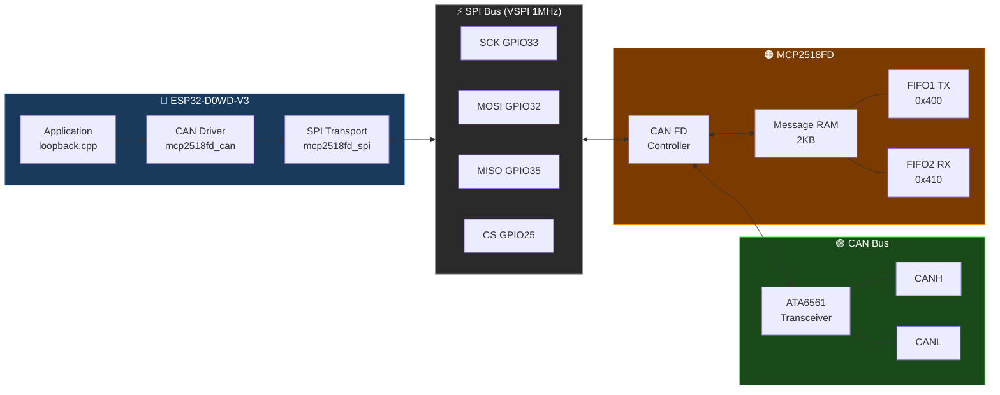

# MCP2518FD CAN FD Driver for ESP32

A register-level CAN FD driver for the **MCP2518FD** external CAN FD controller, running on an **ESP32** over SPI. Built directly from the Microchip datasheet as the source of truth — every register address, bit position and field definition is verified against the official documentation before any code is written.

## System overview



## Why this exists

Every existing Arduino/ESP32 CAN FD library for the MCP2518FD either wraps Microchip's own `canfdspi` API or makes undocumented assumptions about register state. This project builds the driver from scratch, one register at a time, verified against the official Microchip datasheets at every step.

The result is a minimal, auditable reference implementation that anyone can follow, extend, or port — with a clear paper trail from datasheet to working hardware for every decision made.

## Hardware

| Item | Detail |
|---|---|
| MCU | ESP32-D0WD-V3 (rev 3.1), 40 MHz crystal |
| CAN controller | MCP2518FD |
| Transceiver | ATA6561 |
| SPI bus | VSPI — SCK=33, MISO=35, MOSI=32, CS=25 |
| INT | GPIO 34 (unused so far) |

## Progress

| Milestone | Status |
|---|---|
| SPI transport (read8/16/32, write8/32, reset) | ✅ Verified |
| Mode control (config, internal loopback) | ✅ Verified |
| Nominal + data bit timing (125 kbps nominal / 2 Mbps data) | ✅ Verified |
| TDC (transmitter delay compensation, auto mode) | ✅ Verified |
| FIFO register definitions | ✅ Verified |
| FIFO1=TX, FIFO2=RX configuration | ✅ Verified |
| RAM allocation (UA offsets confirmed) | ✅ Verified |
| Transmit a frame (internal loopback) | ✅ Verified |
| Receive a frame (internal loopback) | ✅ Verified |
| Full loopback round-trip verify | ✅ Verified |
| Multi-frame + runtime bitrate switch | ✅ Verified |
| Driver refactor — clean layered API | ✅ Verified |
| Physical bus output (MODE_EXTERNAL_LB, scope verified) | ✅ Verified |
| Normal CAN FD mode (two-node) | 🔲 Not started |

See [`docs/status.md`](docs/status.md) for detailed notes and observed values from each verified step.

## Source of truth

All register addresses, bit positions and field definitions are verified against the official Microchip documentation before any code is written:

| Document | ID | Link |
|---|---|---|
| MCP2518FD Datasheet | DS20006027B | https://www.microchip.com/en-us/product/MCP2518FD |
| MCP25XXFD Family Reference Manual | DS20005678E | https://www.microchip.com/en-us/product/MCP2518FD |

PDFs are not committed to this repo. Download them from the links above and place them in `docs/reference/` — see [`docs/reference/README.md`](docs/reference/README.md).

## Project structure

```
src/
  mcp2518fd_can.h/.cpp      # CAN driver — configure, transmit, receive, bitrate switching
  mcp2518fd_registers.h     # All register addresses, masks and constants
  mcp2518fd_spi.h/.cpp      # SPI transport — raw byte/word reads and writes

examples/
  loopback/loopback.cpp     # Regression test — single-board internal loopback
  two_node/two_node.cpp     # Two-node CAN FD test (not yet implemented)

docs/
  status.md                 # Verified milestone tracker
  context.md                # Hardware decisions and discoveries
  registers.md              # Register field reference
  search.py                 # PDF search tool — queries both datasheets
  reference/                # Place downloaded PDFs here (see reference/README.md)

tools/
  run_test.py               # Test runner — loopback and (future) two-node

library.json                # PlatformIO library manifest
library.properties          # Arduino IDE library manifest
platformio.ini              # PlatformIO build config
```

## Development approach

Each feature is implemented in a single numbered step:

1. Define the expected output from the datasheet **before** writing code
2. Write the minimal code to achieve it
3. Build, upload and monitor in one command:
   ```
   pio run -e loopback --target upload --upload-port COM4 && python tools/run_test.py --env loopback --port COM4
   ```
4. A step is only verified when every assertion prints `OK` on real hardware — no assumptions
5. Commit code + docs together — never commit unverified code

## Key implementation decisions

- **Three-layer architecture** — `mcp2518fd_spi` owns SPI transport, `mcp2518fd_can` owns all chip logic, `examples/loopback/loopback.cpp` is a pure consumer with no register names or RAM addresses
- **Self-documenting configuration** — named presets (`NBTCFG_125K_40MHZ`, `DBTCFG_2M_40MHZ`, `TDC_2M_40MHZ`) mean users configure without needing the datasheet
- **No third-party CAN libraries** — every register touched is sourced directly from the datasheet
- **No 32-bit RMW of CiCON** — REQOP is written via `write8()` to byte 3 only; a full 32-bit read-modify-write was found unreliable on this chip
- **No TXQ, no TEF** — FIFO1=TX, FIFO2=RX only, keeping the driver minimal and auditable
- **No interrupts** — polling only until the core driver is proven correct
- **UA is an offset, not an absolute address** — `CiFIFOUAm` holds the byte offset from RAM base `0x400`; actual address = `0x400 + UA`
- **TDC required at >= 1 Mbps data rate** — automatic mode, TDCO = (BRP+1) × (TSEG1+1)

## Prerequisites

**Firmware**
- [PlatformIO Core](https://docs.platformio.org/en/latest/core/installation/index.html) 6.x
- Espressif32 platform 7.0.1 (pinned in `platformio.ini`)

**Test runner and PDF search tool** (optional)
```bash
pip install -r requirements.txt
```
Then place the two Microchip PDFs in `docs/reference/` — see [`docs/reference/README.md`](docs/reference/README.md).

## Building

Requires [PlatformIO](https://platformio.org/).

```bash
pio run -e loopback --target upload --upload-port <PORT> && python tools/run_test.py --env loopback --port <PORT>
```

Replace `<PORT>` with your serial port (`COM4` on Windows, `/dev/ttyUSB0` on Linux/macOS).

For two-node tests (once implemented):
```bash
pio run -e two_node --target upload --upload-port <PORT> && python tools/run_test.py --env two_node --port-a <PORT_A> --port-b <PORT_B>
```

## License

MIT
