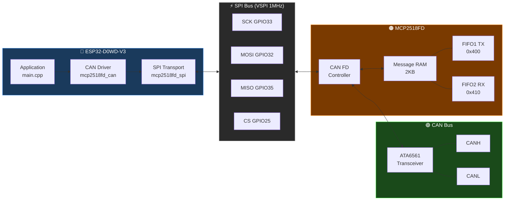

# MCP2518FD CAN FD Driver for ESP32

A register-level CAN FD driver for the **MCP2518FD** external CAN FD controller, running on an **ESP32** over SPI. Built directly from the Microchip datasheet as the source of truth — every register address, bit position and field definition is verified against the official documentation before any code is written.

## System overview



## Why this exists

Every existing Arduino/ESP32 CAN FD library for the MCP2518FD either wraps Microchip's own `canfdspi` API or makes undocumented assumptions about register state. This project builds the driver from scratch, one register at a time, verified against the official Microchip datasheets at every step.

The result is a minimal, auditable reference implementation that anyone can follow, extend, or port — with a clear paper trail from datasheet to working hardware for every decision made.

## Hardware

| Item | Detail |
|---|---|
| MCU | ESP32-D0WD-V3 (rev 3.1), 40 MHz crystal |
| CAN controller | MCP2518FD |
| Transceiver | ATA6561 |
| SPI bus | VSPI — SCK=33, MISO=35, MOSI=32, CS=25 |
| INT | GPIO 34 (unused) |

## Progress

| Milestone | Status |
|---|---|
| SPI transport (read8/16/32, write8/32, reset) | ✅ Verified |
| Mode control (config, internal loopback) | ✅ Verified |
| Nominal + data bit timing (125 kbps nominal / 2 Mbps data) | ✅ Verified |
| TDC (transmitter delay compensation, auto mode) | ✅ Verified |
| FIFO register definitions | ✅ Verified |
| FIFO1=TX, FIFO2=RX configuration | ✅ Verified |
| RAM allocation (UA offsets confirmed) | ✅ Verified |
| Transmit a frame (internal loopback) | ✅ Verified |
| Receive a frame (internal loopback) | ✅ Verified |
| Full loopback round-trip verify | ✅ Verified |
| Multi-frame + runtime bitrate switch | ✅ Verified |
| Driver refactor — clean layered API | ✅ Verified |
| Full 64-byte CAN FD payload (DLC=15) | ✅ Verified |
| Data rates 4/5/8 Mbps | ✅ Verified |
| Physical bus output (MODE_EXTERNAL_LB, scope verified) | ✅ Verified |
| Normal CAN FD mode (two-node) | ✅ Verified |

See [`docs/status.md`](docs/status.md) for detailed notes and observed values from each verified step.

## Repository layout

This repository is structured as a standard PlatformIO library:

```
include/
  mcp2518fd_can.h           # Public driver API — CanMsg, MCP2518Driver, presets
  mcp2518fd_spi.h           # SPI transport layer
  mcp2518fd_registers.h     # All register addresses, masks and constants

src/
  mcp2518fd_can.cpp         # CAN driver implementation
  mcp2518fd_spi.cpp         # SPI transport implementation

examples/
  loopback/                 # Regression test — single-board internal loopback
  two_node/                 # Two-node CAN FD test — bidirectional over real bus
  walkie_talkie/            # Text chat between two nodes over CAN FD
  scope_loopback/           # Continuous TX in MODE_EXTERNAL_LB for scope measurements
  bus_monitor/              # Two nodes continuously talking — bus load + integrity check

docs/
  status.md                 # Verified milestone tracker
  context.md                # Hardware decisions and discoveries
  registers.md              # Register field reference
  search.py                 # PDF search tool — queries both datasheets
  reference/                # Place downloaded PDFs here (see reference/README.md)

tools/
  run_test.py               # Automated test runner for loopback and two-node
  check_timing.py           # Verify bit timing preset values against datasheet formula
  find_timing.py            # Calculate correct NBTCFG/DBTCFG values for a target rate

library.json                # PlatformIO library manifest
library.properties          # Arduino IDE library manifest
```

## Examples

Each example is a self-contained PlatformIO project. Open the example directory in PlatformIO to build and upload.

### loopback

Single-board regression test. Runs entirely inside the MCP2518FD chip using `MODE_INTERNAL_LB` — no bus wiring required. Covers single frames, multi-frame bursts, 64-byte payloads, and data rates from 2 to 8 Mbps. Every assertion prints `OK` or `FAIL`.

```bash
cd examples/loopback
pio run --target upload --upload-port <PORT>
python ../../tools/run_test.py --env loopback --port <PORT>
```

### two_node

Two-board bidirectional test over a real CAN bus. Both boards run the same firmware — send `A` to one and `B` to the other. Tests A→B and B→A at 2/4/5/8 Mbps data rates with 8-byte and 64-byte payloads. No PC coordination required — the chip's retransmission logic handles any power-on race.

Requires: two boards wired CANH↔CANH, CANL↔CANL, 120Ω termination at each end.

```bash
cd examples/two_node
pio run --target upload --upload-port <PORT_A>
pio run --target upload --upload-port <PORT_B>
python ../../tools/run_test.py --env two_node --port-a <PORT_A> --port-b <PORT_B>
```

### walkie_talkie

Text chat between two boards over CAN FD. Type a message in the Serial monitor and press Enter (or wait 300ms) — it arrives on the other board's Serial monitor. Messages up to 63 characters, chunked into 8-byte CAN FD frames automatically.

```bash
cd examples/walkie_talkie
pio run --target upload --upload-port <PORT>
# Open two serial monitors, one per board, at 115200 baud
```

### scope_loopback

Single-board continuous TX in `MODE_EXTERNAL_LB` for oscilloscope measurements. Drives real differential signals on CANH/CANL via the ATA6561 transceiver while the chip ACKs its own frames — no second node required. Press any key to cycle through 2/4/5/8 Mbps data rates.

```bash
cd examples/scope_loopback
pio run --target upload --upload-port <PORT>
```

### bus_monitor

Two boards in `MODE_NORMAL`, both transmitting a counter frame with a `0xDEADBEEF` integrity marker. Each board prints every frame it receives. Adjustable TX interval with `+`/`-`. Good for scope measurements of real two-node bus traffic and for watching the bus under load.

```bash
cd examples/bus_monitor
pio run --target upload --upload-port <PORT>
# Send 'A' to one board, 'B' to the other via serial monitor
```

## API

```cpp
#include "mcp2518fd_can.h"

MCP2518Driver can(spi, PIN_CS);

// Configure — choose nominal rate, data rate, TDC preset, and mode
can.configure(NBTCFG_125K_40MHZ, DBTCFG_2M_40MHZ, TDC_2M_40MHZ, MODE_NORMAL);

// Transmit
CanMsg tx = { .sid=0x123, .fdf=true, .brs=true, .dlc=8 };
for (int i = 0; i < 8; i++) tx.data[i] = i;
can.transmit(tx);

// Non-blocking receive
if (can.available()) {
    CanMsg rx;
    can.receive(rx);
}

// Blocking receive with timeout
CanMsg rx;
can.receive(rx, 500);  // wait up to 500ms

// Switch data rate at runtime
can.setDataBitTiming(DBTCFG_4M_40MHZ, TDC_4M_40MHZ);
```

### Bit timing presets (40 MHz oscillator)

| Constant | Rate |
|---|---|
| `NBTCFG_125K_40MHZ` | 125 kbps nominal |
| `NBTCFG_250K_40MHZ` | 250 kbps nominal |
| `NBTCFG_500K_40MHZ` | 500 kbps nominal |
| `NBTCFG_1M_40MHZ` | 1 Mbps nominal |
| `DBTCFG_1M_40MHZ` | 1 Mbps data |
| `DBTCFG_2M_40MHZ` | 2 Mbps data |
| `DBTCFG_4M_40MHZ` | 4 Mbps data |
| `DBTCFG_5M_40MHZ` | 5 Mbps data |
| `DBTCFG_8M_40MHZ` | 8 Mbps data |

TDC presets (`TDC_1M_40MHZ` … `TDC_8M_40MHZ`) are required for data rates ≥ 1 Mbps.

## Key implementation decisions

- **Three-layer architecture** — `mcp2518fd_spi` owns SPI transport, `mcp2518fd_can` owns all chip logic, examples are pure consumers with no register names or RAM addresses
- **Calculated TX timeout** — derived from configured bit timing at runtime; worst-case 64-byte frame × 3 retransmission attempts + 2ms margin
- **RTXAT + TXAT=3** — chip retries up to 3 times on no-ACK then clears TXREQ cleanly; `transmit()` checks TXABT/TXERR to distinguish success from failure
- **No 32-bit RMW of CiCON** — REQOP is written via `write8()` to byte 3 only
- **No TXQ, no TEF** — FIFO1=TX, FIFO2=RX only
- **No interrupts** — polling only
- **UA is an offset** — `CiFIFOUAm` holds byte offset from RAM base `0x400`; actual address = `0x400 + UA`
- **TDC required at ≥ 1 Mbps** — automatic mode, TDCO = (BRP+1) × (TSEG1+1)

## Source of truth

All register addresses, bit positions and field definitions are verified against the official Microchip documentation before any code is written:

| Document | ID | Link |
|---|---|---|
| MCP2518FD Datasheet | DS20006027B | https://www.microchip.com/en-us/product/MCP2518FD |
| MCP25XXFD Family Reference Manual | DS20005678E | https://www.microchip.com/en-us/product/MCP2518FD |

PDFs are not committed to this repo. Download them from the links above and place them in `docs/reference/` — see [`docs/reference/README.md`](docs/reference/README.md).

## Prerequisites

- [PlatformIO Core](https://docs.platformio.org/en/latest/core/installation/index.html) 6.x
- Espressif32 platform 7.0.1

Optional (test runner and PDF search tool):
```bash
pip install -r requirements.txt
```

## License

MIT
