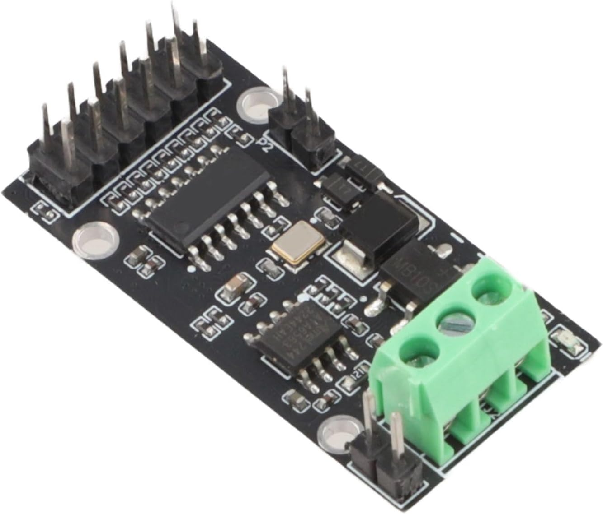

# MCP2518FD CAN FD Driver for ESP32

CAN FD and Classic CAN 2.0B on ESP32 in three lines. The same chip and wiring works on legacy CAN buses and modern FD buses — no hardware changes needed. No third-party CAN library, no magic numbers, no silent failures — every register write traces to a datasheet page and every feature is verified on real hardware before it ships.

```cpp
MCP2518Driver can(spi, PIN_CS);
can.configure(500000, 2000000, MODE_NORMAL);  // 500 kbps nominal, 2 Mbps data

CanMsg tx = { .id=0x123, .fdf=true, .brs=true, .dlc=8 };
can.transmit(tx);

CanMsg rx;
can.receive(rx, 500);  // blocking, 500 ms timeout
```

[](https://github.com/FoodyFood/esp32-mcp2518fd-driver/actions/workflows/ci-checks.yml)
[](https://github.com/FoodyFood/esp32-mcp2518fd-driver/actions/workflows/publish.yml)

---

## Installation

**PlatformIO** — add to `platformio.ini`:
```ini
lib_deps = foodyfood/esp32-mcp2518fd-driver
```

**Arduino IDE** — search for `esp32-mcp2518fd-driver` in the Library Manager.

---

## Quick start

```cpp
#include "mcp2518fd_can.h"

SPIClass      spi(VSPI);
MCP2518Driver can(spi, PIN_CS);

void setup() {
    spi.begin(PIN_SCK, PIN_MISO, PIN_MOSI, PIN_CS);

    CanStatus s = can.configure(500000, 2000000, MODE_NORMAL);
    if (s != CanStatus::OK) { /* handle error */ }
}

void loop() {
    // Transmit
    CanMsg tx = { .id=0x123, .fdf=true, .brs=true, .dlc=8 };
    for (int i = 0; i < 8; i++) tx.data[i] = i;
    can.transmit(tx);

    // Receive — non-blocking
    CanMsg rx;
    if (can.available()) can.receive(rx);

    // Receive — blocking with timeout
    can.receive(rx, 500);
}
```

**[Full API reference →](docs/api.md)**

---

## Features

**Framing**
- CAN FD frames up to 64 bytes, Classic CAN frames, 11-bit and 29-bit IDs on the same bus
- Non-blocking and blocking receive with timeout
- Transmit result tells you exactly what went wrong — no ACK, bus error, or FIFO full

**Bit rates**
- One call sets nominal and data rates — no register maths, no presets to look up
- 125 kbps – 1 Mbps nominal / 1 – 5 Mbps data at 20 MHz; up to 8 Mbps at 40 MHz
- Switch data rate at runtime without losing the nominal configuration

**Filtering**
- Up to 32 acceptance filters — exact ID, masked range, SID or EID
- Catch-all filter active by default; narrow it down when you need to

**Reliability**
- Interrupt-driven RX via INT pin — frame arrival wakes an ISR, no polling required
- Bus error detection with TEC/REC counters, error-passive and bus-off flags
- Per-frame hardware timestamps at 50 ns resolution

**Modes**
- Normal, listen-only, internal loopback, external loopback, sleep
- **Classic CAN 2.0B** — the same chip and wiring works on legacy CAN buses, no hardware changes needed. OBD-II, older ECUs, industrial sensors and PLCs all see it as a normal CAN node
- `stop()` / `restart()` / `sleep()` / `wake()` lifecycle control
- CLKO output pin configurable for clocking a second MCP2518FD chip

---

## Use cases

| Use case | Description |
|---|---|
| **EV battery gateway** | Read cell voltages, SOC and temperatures from a CAN FD BMS (Kia 64 FD, VW MEB) and re-publish over a second bus or WiFi |
| **Battery simulator** | Impersonate a real EV battery pack — transmit the periodic BMS frames a solar inverter or charger expects, so you can develop and test without a physical battery |
| **UDS diagnostics** | Send ISO 14229 requests to a vehicle ECU over CAN FD and receive multi-frame ISO-TP responses |
| **Inverter interface** | Send torque/speed setpoints to a CAN FD motor controller and read back telemetry at 10 ms intervals |
| **CAN FD data logger** | Capture every frame on a bus with per-frame timestamps, stream in candump format over USB Serial |
| **Peer-to-peer telemetry** | Two ESP32 boards talking directly over CAN FD — sensor nodes, drone ESCs, data concentrators |
| **Scope / analyser stimulus** | Drive known CAN FD frames onto the bus for oscilloscope or protocol analyser capture |
| **Production self-test** | Verify chip and transceiver wiring at factory or field bring-up — no second node required |
| **Classic CAN gateway** | Bridge a legacy CAN 2.0B bus to a CAN FD network — receive classic frames and re-transmit as FD, or vice versa |
| **Dual-chip board (T-2CAN FD)** | Drive two MCP2518FD chips from one ESP32 — configure the first chip's CLKO pin to clock the second |
| **ISOBUS / precision agriculture** | Silently tap a tractor's ISOBUS backbone in listen-only mode — decode engine load, fuel rate, GPS and implement status without touching the machine |
| **Low-power sleep/wake node** | Battery-powered sensor that sleeps between readings, wakes on a specific CAN frame via the INT pin, transmits one frame, and sleeps again |
| **OBD-FD live data** | Read OBD-II PIDs from post-2023 vehicles that have moved their powertrain bus to CAN FD — DIY dashboards, track loggers, emissions monitors |
| **Robotics actuator bus** | USB↔CAN FD bridge between a ROS 2 host and CAN FD servo drives (Moteus, ODrive) — 1 ms control loop, interrupt-driven RX, per-frame timestamps |
| **Marine NMEA 2000 monitor** | Decode GPS, depth, wind and AIS from a boat's N2K backbone in listen-only mode — re-publish over WiFi to a phone or chart plotter |
| **DC fast charger bench test** | Simulate a CCS/CHAdeMO power module on the bench — test a charger controller without live high-voltage hardware |

---

## Examples

Each example is a self-contained PlatformIO project — open, build and flash directly.

| Example | What you'll learn |
|---|---|
| [`walkie_talkie`](examples/walkie_talkie/) | Send and receive variable-length messages between two boards — the two-node pattern in its simplest form |
| [`int_pin`](examples/int_pin/) | Wire the INT pin so frame arrival triggers an ISR instead of polling — main loop stays free |
| [`scope_loopback`](examples/scope_loopback/) | Drive real CAN FD signals on CANH/CANL from a single board — no second node needed for scope measurements |
| [`uds_filter`](examples/uds_filter/) | Set an acceptance filter so your board only wakes up for the frames it cares about — demonstrated with a UDS request/response pattern |
| [`can_logger`](examples/can_logger/) | Passively monitor a CAN bus in listen-only mode with per-frame hardware timestamps — completely invisible to other nodes |
| [`classic_can`](examples/classic_can/) | Use the MCP2518FD as a plain CAN 2.0B controller to talk to legacy devices — demonstrated with a vehicle ECU and dashboard simulation |

---

## Verified on real hardware

Every feature was developed and verified on real hardware — not simulated, not assumed. The oscilloscope capture below shows a live CAN FD data burst: CANH, CANL, and the A−B differential. Clean edges, correct differential swing, no ringing.




| Item | Detail |
|---|---|
| MCU | ESP32-D0WD-V3 (rev 3.1) |
| CAN controller | MCP2518FD |
| Oscillator | 20 MHz crystal |
| Transceiver | ATA6561 |
| SPI | VSPI — SCK=33, MISO=35, MOSI=32, CS=25 |
| INT | GPIO 34 |

Other ESP32 boards and MCP2518FD breakout variants should work provided the SPI pins are configured correctly. See [docs/hardware.md](docs/hardware.md) for wiring details.

---

## Why this driver

Existing Arduino/ESP32 CAN FD libraries for the MCP2518FD wrap Microchip's reference `canfdspi` API — a codebase full of undocumented assumptions, magic numbers and silent failure modes. In production hardware — EV gateways, inverter interfaces, diagnostic tools — that is not acceptable.

This driver was built because nothing available could be trusted in a real product.

- **Production-grade reliability** — every feature is verified on two real hardware nodes under real bus conditions before it ships. Bus signals are confirmed on a DSO. If it isn't verified on hardware, it isn't in the driver.
- **Zero hidden state** — every register write traces directly to a datasheet page. No magic numbers, no inherited assumptions, no surprises when you read the source.
- **Minimal and dependency-free** — no RTOS, no heap allocation, no third-party CAN library. Just Arduino SPI and direct register access. Less code means fewer failure modes.

The result is a driver you can ship in a product and stand behind.

---

## Documentation

| Document | Description |
|---|---|
| [API reference](docs/api.md) | Every public type, method, parameter and return value |
| [Hardware setup](docs/hardware.md) | Pin table, SPI config, INT pin wiring, bus termination |
| [Use case coverage](docs/use_cases/coverage.md) | Feature-by-use-case coverage matrix |

---

## Contributing

Bug reports, hardware compatibility reports and PRs are welcome. See [CONTRIBUTING.md](CONTRIBUTING.md).

## License

MIT
